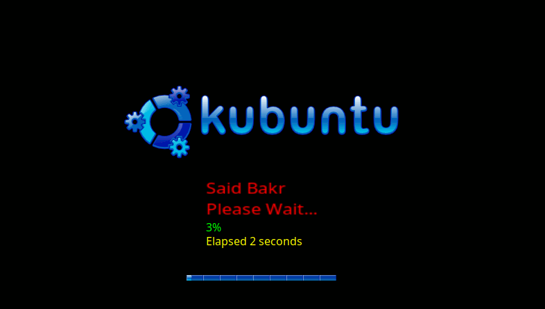

# bakr-plymouth
Plymouth boot splash for Linux forked from KUBUNTU-6.10-BOOT-SPLASH-PORT ver. 1.0.0

Checkout the original work on the [KDE Store](https://store.kde.org/p/1511317/)



# Usage
After running the `INSTALL.sh` script, you should edit the `bakr-plymouth-theme.script` to customize the text message like the description below:
* Go to the following path: `/usr/share/plymouth/themes/bakr-plymouth-theme`
* Open the file named `bakr-plymouth-theme.script` with sudo priviledges to be able to save it. In Kde Plasma `Kate` could able to save after asking for root password.
* Look for a line starts with, `// Edit the following two variables`, *at the few initial lines of the file*
* At the next two lines edit the textual values of the two variables `distroStr` & `waitStr` with any text you want.
* Save the file
* from the command line run the following line: 
`sudo update-alternatives --config default.plymouth && sudo update-initramfs -u`
* Make sure to choose `bakr-plymouth-theme` if it is not the default one by entering its number and hit enter.


# Features
* Show custom message could be set from the script file before installation or using ``sudo update-alternatives --config default.plymouth && sudo update-initramfs -u` after instlltion.
* Digital number of loading percentage
* Elabesd loading time in seconds.
* Latest 19 boot log entries from top to bottom.

# For developers
You may have to install `plymouthd` and `plymouth-x11` for testing and debuging without need to restart the system nor applying `update-initramfs` using the following bash command or something like it:
```
sudo plymouthd ; sudo plymouth --show-splash;sudo plymouth ask-for-password --prompt "Enter Password: " |$(read -s;if [$REPLAY == "y"]then true fi); for ((I=0; I<10; I++)); do sleep 1 ; sudo plymouth --update="Boot Log Test $(date)"$I ; done ;sudo plymouth --quit
```


## Notice:
Boot log render is modified from COGWHEEL-A-SPINNER-LOG-PGR-2-INVERSION_V1.0_PLYMOUTH-THEME

